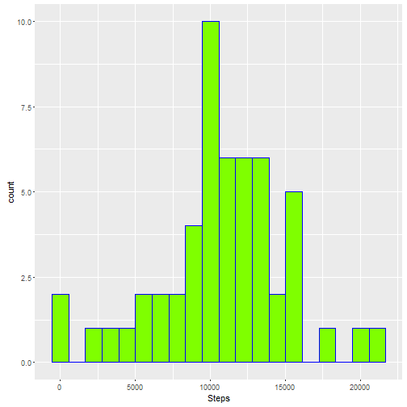
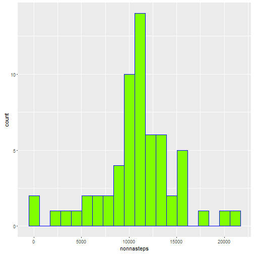
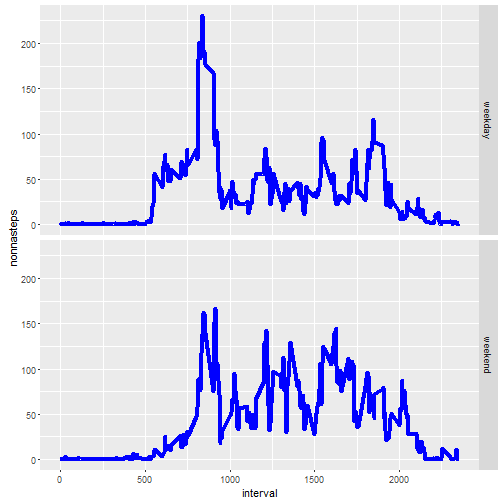

### Load data into R and preprocess


dat is the original dataset  
Update date variable to be date instead of chr  

datnona is the dataset without NA values  


```r
library(ggplot2)
dat <- dat <- read.csv("activity.csv", stringsAsFactors = FALSE)
dat$date <- as.Date(dat$date, format = "%Y-%m-%d")

datnona <- dat[!is.na(dat$steps),]
```

### Mean total number of steps taken per day

Calculate the total number of steps taken per day  

```r
ttlstepsperday <- aggregate(formula = datnona$steps ~ datnona$date, data = dat, FUN = sum)
names(ttlstepsperday) <- c("Date", "Steps")
print(ttlstepsperday)
```

```
##          Date Steps
## 1  2012-10-02   126
## 2  2012-10-03 11352
## 3  2012-10-04 12116
## 4  2012-10-05 13294
## 5  2012-10-06 15420
## 6  2012-10-07 11015
## 7  2012-10-09 12811
## 8  2012-10-10  9900
## 9  2012-10-11 10304
## 10 2012-10-12 17382
## 11 2012-10-13 12426
## 12 2012-10-14 15098
## 13 2012-10-15 10139
## 14 2012-10-16 15084
## 15 2012-10-17 13452
## 16 2012-10-18 10056
## 17 2012-10-19 11829
## 18 2012-10-20 10395
## 19 2012-10-21  8821
## 20 2012-10-22 13460
## 21 2012-10-23  8918
## 22 2012-10-24  8355
## 23 2012-10-25  2492
## 24 2012-10-26  6778
## 25 2012-10-27 10119
## 26 2012-10-28 11458
## 27 2012-10-29  5018
## 28 2012-10-30  9819
## 29 2012-10-31 15414
## 30 2012-11-02 10600
## 31 2012-11-03 10571
## 32 2012-11-05 10439
## 33 2012-11-06  8334
## 34 2012-11-07 12883
## 35 2012-11-08  3219
## 36 2012-11-11 12608
## 37 2012-11-12 10765
## 38 2012-11-13  7336
## 39 2012-11-15    41
## 40 2012-11-16  5441
## 41 2012-11-17 14339
## 42 2012-11-18 15110
## 43 2012-11-19  8841
## 44 2012-11-20  4472
## 45 2012-11-21 12787
## 46 2012-11-22 20427
## 47 2012-11-23 21194
## 48 2012-11-24 14478
## 49 2012-11-25 11834
## 50 2012-11-26 11162
## 51 2012-11-27 13646
## 52 2012-11-28 10183
## 53 2012-11-29  7047
```


Histogram of total steps per day  


```r
ggplot(ttlstepsperday, aes(x = Steps)) + geom_histogram(bins = 20, col = "blue", fill = "#7fff00")
```



Calculate and report the mean and median of the total number of steps taken per day  


```r
mn <- mean(ttlstepsperday$Steps)
md <- median(ttlstepsperday$Steps)
```

The mean steps per day is 1.0766189 &times; 10<sup>4</sup>  
The median steps per day is 10765

### Average daily activity pattern


```r
ttlstepsperintv <- aggregate (formula = steps ~ interval, data = datnona, FUN = mean)
```

Time series plot of the 5-minute interval and the average number of steps taken,
averaged accross all days  


```r
ggplot(data = ttlstepsperintv, aes(x = interval, y = steps)) + geom_line()
```


Calculate the 5 minute interval, on average across all the days, contains the maximum number of steps  

```r
maxintv <- ttlstepsperintv[ttlstepsperintv$steps == max(ttlstepsperintv$steps), ]
```

The 5-minute interval with the maximum number of steps is 835, 206.1698113  


### Inputing missing values

Calculate the total number of missing values in the dataset  

```r
numnas <- sum(is.na(dat$steps))
```

The number of NAs is 2304  

The strategy I used to fill in missing values was to use the mean of that interval over all days  

Create new dataset with all missing data filled in  
I did this in 2 steps.  
1. Create column and put the mean of the interval  
2. Create another column and put either the steps or the mean

```r
dat$newsteps <- ave(dat$steps, dat$interval, FUN = function(x) mean(x[!is.na(x)]))
dat$nonnasteps <- replace(dat$steps, is.na(dat$steps), dat$newsteps[is.na(dat$steps)])
```

Make histogram of total number steps each day  

```r
ttlstperday <- aggregate(formula = nonnasteps ~ date, data = dat, FUN = sum)
ggplot(ttlstperday, aes(x = nonnasteps)) + geom_histogram(bins = 20, col = "blue", fill = "#7fff00")
```



Calculate mean and median total number of steps taken per day  

```r
mn2 <- mean(ttlstperday$nonnasteps)
md2 <- median(ttlstperday$nonnasteps)
```

The mean steps per day is 1.0766189 &times; 10<sup>4</sup>  
The median steps per day is 1.0766189 &times; 10<sup>4</sup>


The values at the beginning of the exercise were:  
The mean steps per day is 1.0766189 &times; 10<sup>4</sup>  
The median steps per day is 10765

The difference is (after replace NA - before):  
Mean: 0
Median: 1.1886792


The impact is surprisingly minimal.


### Differences between activity patterns between weekdays and weekends

Create new factor variable in dataset with two levels: "weekday" and "weekend" 

```r
dat$day <- sapply(dat$date, FUN = function(x) {if(weekdays(x) == "Saturday" || weekdays(x) == "Sunday") "weekend" else "weekday"})

##avg steps by interval and weekday/weekend
avgsteps <- aggregate(formula = nonnasteps ~ interval + day, data = dat, FUN = mean)
```

Make a panel plot containing a time series plot of the 5-minute interval and the average number of
steps taken, averaged across all weekday days or weekend days  

```r
ggplot(data = avgsteps, aes(x = interval, y = nonnasteps)) + geom_line(size = 1.5, color = "blue")+facet_grid(day ~ .)
```


